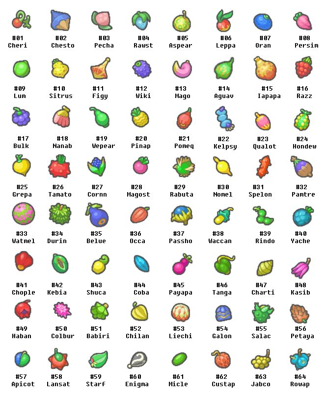

# Berry

The `Berry` entities is used to map data from `https://pokeapi.co/api/v2/berry/...`.



## `Berry`

The `Berry` class can be used to get data from `/berry/{id or name}`.

```kotlin
val berry = PokeApi.get<Berry>(id = 1)
```

## `BerryFirmness`

The `BerryFirmness` class can be used to et data from `/berry-firmness/{id or name}`.

```kotlin
val berryFirmness = PokeApi.get<BerryFirmness>(id = 1)
```

## `BerryFlavor`

The `BerryFlavor` class can be used to get data from `/berry-flavor/{id or name}`.

```kotlin
val berryFlavor = PokeApi.get<BerryFlavor>(id = 1)
```
